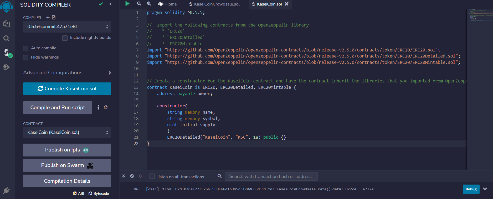
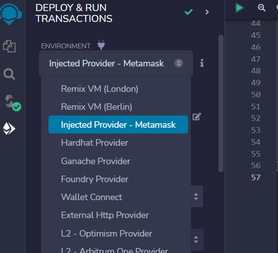
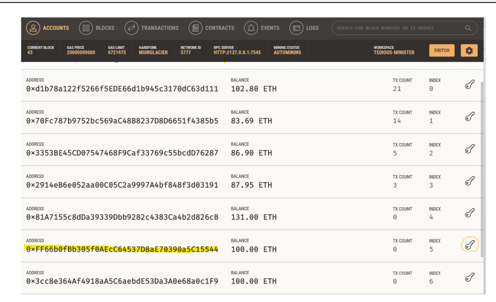
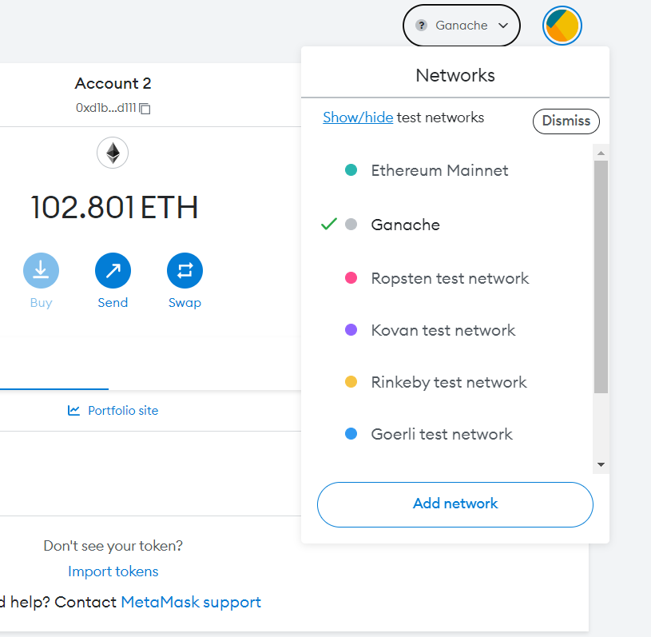
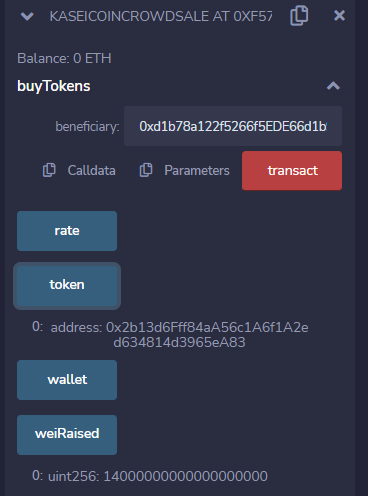
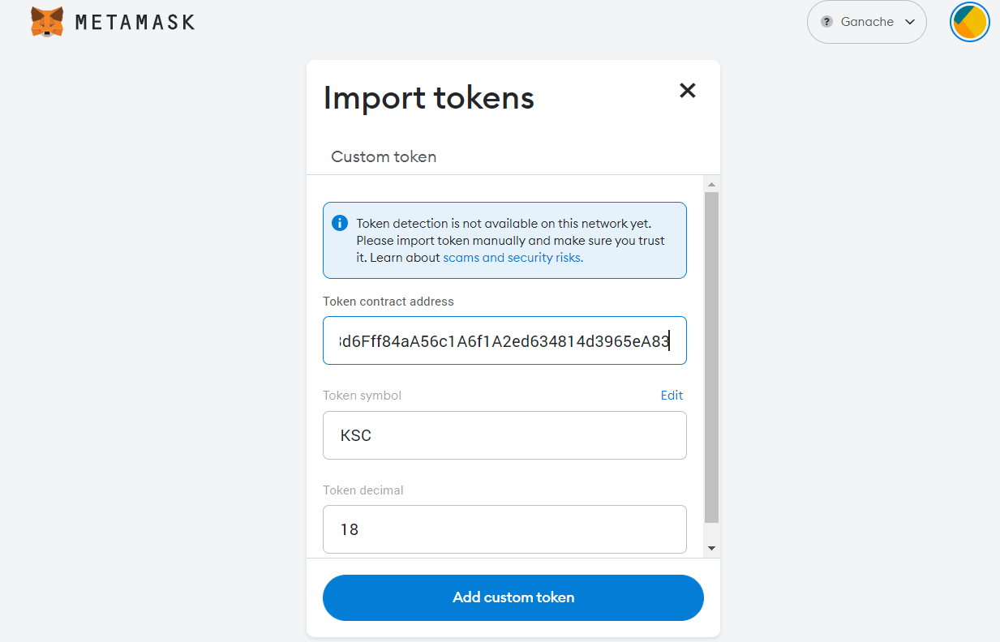
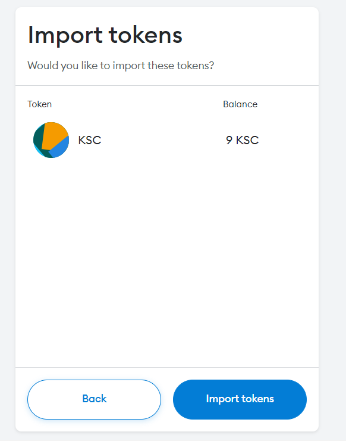

# MaaKaiKaseiCoin
An ERC-20 coin deployed via a crowdsale contract.

## Platforms and requirements
This is Solidity code inheriting the following contracts from the OpenZeppelin library.

ERC20  
ERC20Detailed
ERC20Mintable

Crowdsale
MintedCrowdsale

The code is written, compiled and deployed in Remix IDE, using Pragma version 0.5.5
The Test Blockchain used is Ganache.
Ganache wallets are connected to MetaMask and Remix is also connected to Metamask to use these wallets for testing.
The Open Zeppelin library for this setup is Version 2.5

## Evaluation

The contracts performed as expected. 
Ganache and Metamask worked well with this project.

You can see 14 Ether worth of Wei raised after this recent transaction
 

One Caveat, the coins can be found and imported into MetaMask but remain invisible from there

## Video of contracts being tested

In the video link below, you can see
The contract is deployed onto the local Ganache blockchain. It is compiled and deployed via Remix IDE and this is connected to Metamask using Ganache test wallets.
Functionality of the crowdsale is shown via buying new tokens and reviewing the coresponding account balance movements. 
You can also see the increases in total Wei raised in the process.

https://youtu.be/abi1IIRrn8c
